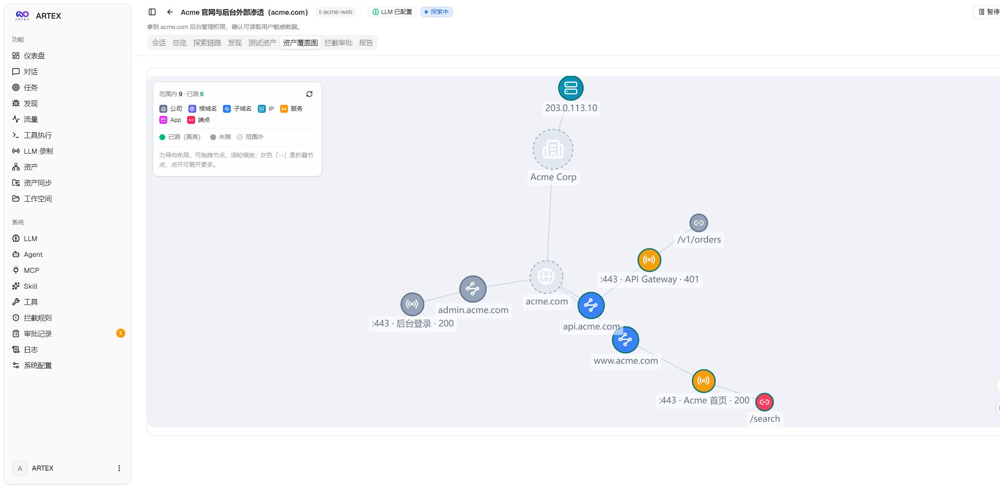
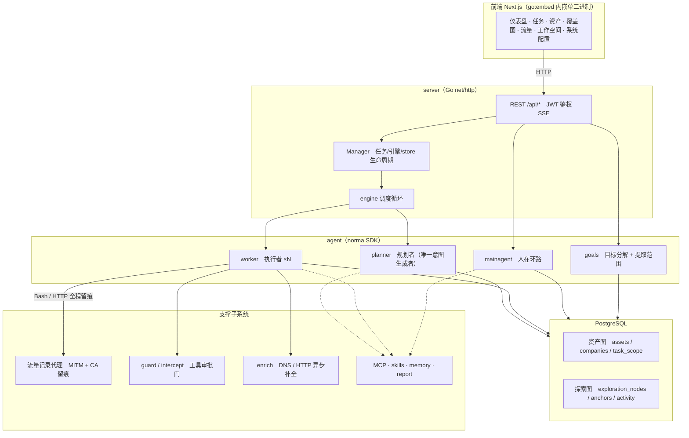
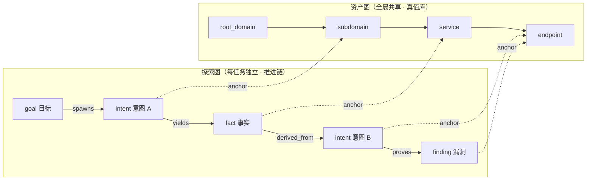
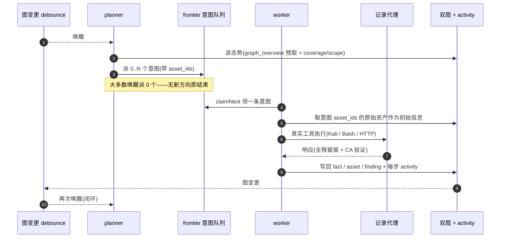
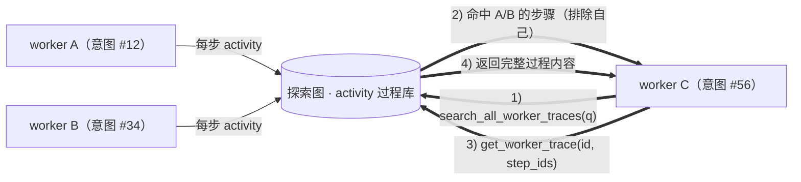
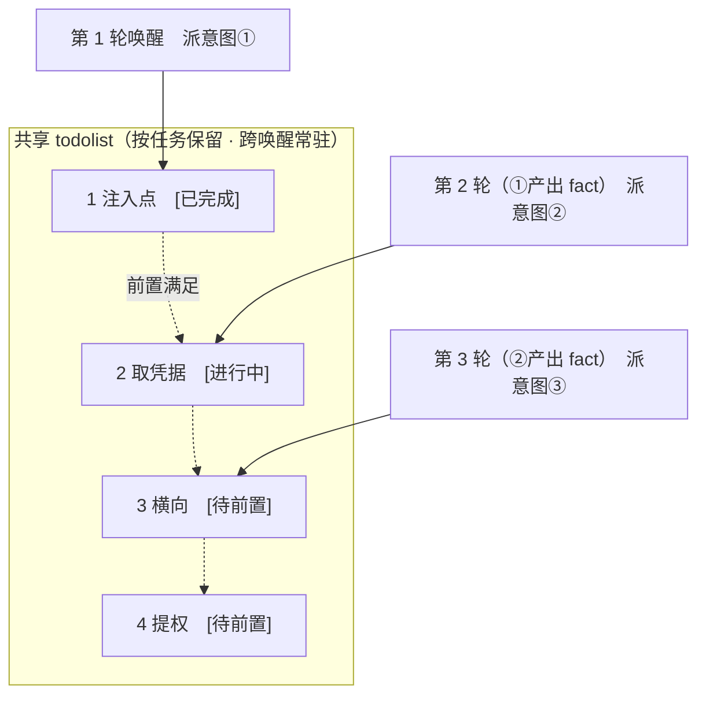

<div align="center">

# ARTEX

AI 自主渗透测试系统（Go 后端 + Next.js 前端）


🌐 **在线 Demo**： [https://artex-demo.vercel.app/](https://artex-demo.vercel.app/)

</div>

---

## 截图预览

> 完整交互见[在线 Demo](https://artex-demo.vercel.app/)。

| 仪表盘（总览 / Token 消耗 / 活动流） | 任务列表 |
| :---: | :---: |
|  |  |

| 任务 · 执行过程（会话 / 工具调用） | 探索链路 |
| :---: | :---: |
|  |  |

| 发现 | 资产 |
| :---: | :---: |
|  |  |

| 资产覆盖图（力导向布局 · 已测高亮 · 节点折叠展开） |
| :---: |
|  |

| 流量录制 | 人在环路对话 |
| :---: | :---: |
|  |  |

| Agent 管理 | LLM 配置 |
| :---: | :---: |
|  |  |

| 拦截审批 | 后端日志 |
| :---: | :---: |
|  |  |


---

## 资产同步（ScopeSentry）

支持从 [ScopeSentry](https://github.com/Autumn-27/ScopeSentry) 直接同步资产数据，免去重复收集：

- 在「**资产同步**」页填 ScopeSentry 的地址与 API Key，接入数据源；
- 按**项目**或**任务**维度选择要同步的目标与资产类型（域名 / 子域 / IP / 端口 / 站点 / 端点…）；
- 一键导入并按公司资产范围归并，直接进入 ARTEX 的资产图供 agent 探索使用。

---

## 部署

> 依赖数据库 **PostgreSQL**；探索需配置 **LLM**（`ANTHROPIC_API_KEY` 或 `OPENAI_API_KEY`，也可在 UI 里配）。

### 本地打包

```bash
git clone https://github.com/Autumn-27/ARTEX.git
cd ARTEX
./pack.sh [amd64|arm64]
```

`pack.sh` 会构建前端、交叉编译 Linux 二进制、编译内置工具，并生成 `artex-deploy.tar.gz`。可通过 `ARTEX_TASK_URL` 写入任务回调地址。

### 一键远程部署

```bash
REMOTE_DIR=artex SSH_PORT=22 ./deploy.sh user@server [amd64|arm64]
```

`deploy.sh` 会调用 `pack.sh`，上传部署包到远端，执行 `build-local.sh` 构建镜像并启动。首次部署和更新使用同一条命令；`REMOTE_DIR`、`SSH_PORT`、`ARTEX_TASK_URL` 可按需通过环境变量指定。

### 本地启动

```bash
./dev.sh
```

`dev.sh` 会同时启动后端 `:8787`、流量代理 `:8788` 和前端开发服务器 `:5173`。

### Docker Compose（手动）

```bash
git clone https://github.com/Autumn-27/ARTEX.git
cd ARTEX
cp .env.example .env          # 填 POSTGRES_PASSWORD、可选 ANTHROPIC_API_KEY
docker compose up -d          # 拉取 autumn27/artex 镜像 + postgres
# → http://localhost:8787
```

镜像已含常用工具（ripgrep/curl/vim/npm/nmap…）；`./skills` 与 `./data` 以绑定挂载持久化。

### 下载预编译二进制（Releases）

到 [Releases](https://github.com/Autumn-27/ARTEX/releases) 下载对应平台的 zip，解压后得到 `artex` + `skills/` + `config.example.json`：

```bash
cp config.example.json config.json   # 填好 database 连接
./artex                              # → http://localhost:8787
```

> 升级只换程序、不动数据：Postgres 数据卷 `pgdata`、`./data`（jwt.key / SQLite 等）、`./skills` 都会保留。**数据库迁移无需手动执行**——`artex` 每次启动会幂等重跑 `schema.sql`（含 `ADD COLUMN` / `CREATE INDEX IF NOT EXISTS`），即“重启即迁移”。升级前仍建议先备份 `./data` 与数据库。

### 手动更新

```bash
cd ARTEX
git pull                       # 更新 compose / 脚本（可选）
# 指定版本：在 .env 设 ARTEX_TAG=v0.2.0；不设则用 latest
docker compose pull artex
docker compose up -d artex     # 换新镜像重启 → 自动迁移 schema
docker image prune -f          # 清理旧镜像（可选）
```

---

## 配置

**数据库**（`config.json`，或用环境变量 `ARTEX_PG_DSN` 覆盖）：

```json
{
  "database": {
    "host": "127.0.0.1", "port": 5432,
    "user": "artex", "password": "yourpass",
    "dbname": "artex", "sslmode": "disable"
  }
}
```

**LLM**：`export ANTHROPIC_API_KEY=sk-...`（或 `OPENAI_API_KEY`），也可在 UI 的「LLM 配置」页填写。
可选：`ARTEX_LLM_PROVIDER` / `ARTEX_LLM_MODEL` / `ARTEX_LLM_BASE_URL` / `ARTEX_LLM_PROXY`。

**并发**：每个任务的 work agent 数在「系统设置」里配置（默认 3）。

**常用参数**：`./artex -addr :8787 -proxy :8788`（`-addr` 前端+API，`-proxy` 流量录制代理）。

---


## 开发

```bash
./dev.sh    # 后端(:8787) + 流量代理(:8788) + 前端 next dev(:5173) → http://localhost:5173
```

### 根目录脚本

| 脚本 | 用途 |
| --- | --- |
| `pack.sh` | 本地打包：构建前端、Linux 二进制、内置工具和完整部署包。 |
| `deploy.sh` | 一键远程部署：打包、上传、远端构建镜像并启动。 |
| `dev.sh` | 本地启动：同时运行后端、流量代理和前端开发服务器。 |

- 后端：`go run ./cmd/artex`（不带 `-tags embedui` 则不内嵌前端）
- 前端：`cd web && npm run dev`（`/api` 反代到后端，带热更新）
- 测试：`go test ./...`
- Mock 预览（无后端）：`cd web && NEXT_PUBLIC_MOCK=1 npm run dev`

### 前端脚本

| 命令 | 用途 |
| --- | --- |
| `npm run dev` | 启动 Next.js 开发服务器，支持热更新和 `/api` 反代。 |
| `npm run build:static` | 生成纯静态前端到 `web/out`，用于内嵌后端或独立静态部署。 |
| `npm run format` | 用 Biome 自动格式化前端代码。 |
| `npm run check` | 只报错误的快速质量检查，适合日常开发。 |
| `npm run check:all` | 完整 Biome 检查，包含警告，用于提交前审计。 |
| `npm run generate:presets` | 从主题 CSS 生成 `theme.ts` 预设元数据；pre-commit 会自动执行。 |
| `npm run prepare` | 安装依赖后初始化 Husky Git 钩子。 |

---

## 系统技术架构

ARTEX 是一套 **LLM 多 agent 驱动的自主渗透系统**：Go 单体后端（内嵌 Next.js 前端）+ PostgreSQL，agent 能力由 [`norma`](https://github.com/Autumn-27/norma) SDK 提供（`agentcore` / `tool` / `permission` / `harness` / `memory` / `transcript`）。核心是**双图架构**，以及围绕它的两条自主性机制：**worker 间过程级信息交换**与 **planner 多轮共享 todolist 稳定攻击链路**。

### 总体分层



| 层 | 职责 |
| --- | --- |
| **前端** | Next.js 静态导出，`go:embed` 内嵌进单二进制；可视化任务/资产/探索链路/覆盖图，人在环路对话 |
| **server** | `net/http` 路由 + JWT 鉴权 + SSE；`Manager` 托管任务、引擎、DB store 的生命周期 |
| **engine** | 每任务一个 `plannerLoop` + N 个 worker goroutine；意图领取、超时/暂停/drain |
| **agent** | goals / planner / worker / mainagent，`ToolSet` 把双图暴露成 LLM 工具 |
| **db** | 双图的 Postgres 落地（pgx）；schema 随 `go:embed` 每次启动幂等建表 |
| **支撑** | 记录型 MITM 代理、审批门、异步补全、MCP/技能/记忆/报告 |

### 双图架构：探索图 + 资产图

系统把「**目标是什么**」和「**测到了什么程度**」拆成两张相互独立、又通过锚点相连的图：

- **资产图（Asset Graph，全局共享）**：跨任务同一份的资产真值库。节点为 `root_domain / subdomain / ip / service / app / endpoint`，归属公司；域名→子域→服务→端点的父子关系与去重 key 全部由程序计算，agent 只提交原始信息。
- **探索图（Exploration Graph，每任务独立）**：一次任务的“思考与推进”过程。节点为 `goal（目标）/ intent（意图）/ fact（事实）/ finding（漏洞）/ hint（提示）`，靠 `spawns / derived_from / yields / proves` 等边连成**血缘链**，回答“哪个方向派生自哪些事实、产出了什么”。
- **两图靠锚点相连**：`exploration_anchors(node_id, asset_id)` 把意图/事实/漏洞锚定到具体资产上——于是既能从“探索方向”看它打的是哪些资产，也能从“某个资产”反查它在本任务被哪些意图测过、得出过哪些事实。这也支撑了**资产测试覆盖度**与**资产覆盖图**（范围内资产 + 已测高亮）。



> 分工：**planner** 读探索图态势、判目标、只在有未覆盖的新方向时派**意图**进 frontier；**worker** 领**一条意图**、用真实工具执行、把新资产/事实/漏洞写回两图后即停。资产图是共享事实，探索图是每任务的推进链。

### 引擎与意图生命周期（一次探索的闭环）

引擎是**事件驱动**的闭环：图一变就唤醒 planner，planner 派意图，worker 领意图执行并写回，写回又触发下一轮——直到目标被证明（`prove_goal`）。



### worker 间的过程级信息交换

一次深入的探索里，很多有价值的观察（某个报错、某段响应、某个隐藏参数）出现在一个 worker 的**执行过程**中，却未必被写成正式 fact。为避免重复劳动、让链路上的 worker 能站在彼此的肩膀上，worker 具备**跨 work 检索过程**的能力：

- `search_all_worker_traces(q)`：在**本任务其他 work 的执行过程**里按关键字检索（自动排除自己这条意图的步骤），命中项带 `intent_id`；
- `list_worker_traces` / `get_worker_trace(intent_id, step_ids=[…])`：先看有哪些 work 跑过，再取某个 work 具体几步的完整内容做细节交换。

这样即便探索图上还没有对应的 fact，后续 worker 也能复用他人过程中的观察——**信息在 worker 之间以“执行过程”为粒度流动**，而边界不变（每个 worker 仍只做自己领到的那条意图）。



### planner 多轮共享 todolist → 稳定的攻击链路

真实攻击链往往是**有前后依赖的多步序列**（如：发现注入点 → 拿到凭据 → 横向 → 提权），一次性把这些并行派下去只会乱套。planner 因此持有一份**按任务保留、跨唤醒共享的规划待办（todolist）**：

- planner 是事件驱动的——图一变就被唤醒，但**每次唤醒是全新会话**；共享的 todolist 让它把一条串行利用链**记录一次**、然后在后续多轮里**按依赖逐步派意图**，而不是把整条链在一轮里全部前置展开；
- 每轮只对「前置步骤已完成、其依赖的 fact 已存在」的下一步派意图，并随进展更新清单（把已被 fact 满足的步骤标完成）。



于是攻击链在“事件驱动 + 无状态会话”的环境下依然**稳定推进、不重复、不错序**——这是 ARTEX 能自主走完多步利用链的关键。

---
## 参考

https://github.com/oritera/Cairn


## 许可

仅供授权测试与研究使用。
